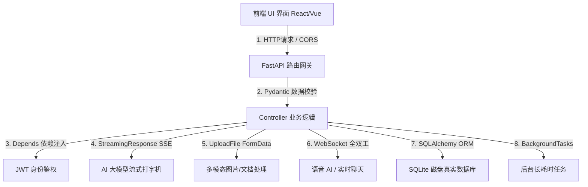

# 🚀 前端转全栈：Python 全栈核心知识图谱与全流程实战指南

欢迎来到前端转全栈与 AI 全栈工程师开发营！
作为拥有 JavaScript / TypeScript / React / Vue 背景的前端工程师，转型 Python 全栈拥有巨大的先天优势——因为**全栈的核心不仅在于后端逻辑，更在于前端交互与后端 API 的协同机制**。

本目录为你量身打造了从 Node.js / Express 思维切换到 Python FastAPI 全栈开发的完整学习路径与可运行 Demo。

---

## 🗺️ 5 阶段终极学习路线图 (3 ~ 4 周全栈通关)

```mermaid
graph LR
    P1[阶段 1: Python 语法速成<br/>(3-5 天)] --> P2[阶段 2: FastAPI后端与数据库<br/>(5-7 天)]
    P2 --> P3[阶段 3: AI全栈三件套<br/>(7 天)]
    P3 --> P4[阶段 4: Function Calling与Agent<br/>(7-10 天)]
    P4 --> P5[阶段 5: Docker与运维上线<br/>(3-5 天)]
```

### 📍 阶段一：Python 语法快速过关 (3 ~ 5 天)
*   **目标**：利用 JS/TS 储备快速掌握 Python 20% 核心精髓。
*   **对应练习**：[00_JS前端专属_Python速成Demo](file:///f:/project/AI%E5%BA%94%E7%94%A8%E5%BC%80%E5%8F%91/AI%20appointment%20develop/python/00_JS%E5%89%8D%E7%AB%AF%E4%B8%93%E5%B1%9E_Python%E9%80%9F%E6%88%90Demo) 里的 01~08 号 Demo 文件。
*   **核心攻克**：解包与列表推导式、JSON 容错解析、Type Hints 类型提示、`@dataclass` 和 `asyncio` 异步。

### 📍 阶段二：FastAPI 全栈后端与真实数据库落盘 (5 ~ 7 天)
*   **目标**：用 Node.js/Express 思维写 Python FastAPI 后端，实现 RESTful API、JWT 登录与磁盘数据库读写。
*   **对应练习**：
    *   基础路由与 Swagger：[`01_FastAPI基础路由与参数_Express对比.py`](file:///f:/project/AI%E5%BA%94%E7%94%A8%E5%BC%80%E5%8F%91/AI%20appointment%20develop/python/00_%E5%89%8D%E7%AB%AF%E8%BD%AC%E5%85%A8%E6%A0%88_%E6%A0%B8%E5%BF%83%E7%9F%A5%E8%AF%86%E4%B8%8E%E5%AE%9E%E6%88%98/01_FastAPI%E5%9F%BA%E7%A1%80%E8%B7%AF%E7%94%B1%E4%B8%8E%E5%8F%82%E6%95%B0_Express%E5%AF%B9%E6%AF%94.py)
    *   JWT 身份鉴权：[`03_用户鉴权与JWT_Middleware对比.py`](file:///f:/project/AI%E5%BA%94%E7%94%A8%E5%BC%80%E5%8F%91/AI%20appointment%20develop/python/00_%E5%89%8D%E7%AB%AF%E8%BD%AC%E5%85%A8%E6%A0%88_%E6%A0%B8%E5%BF%83%E7%9F%A5%E8%AF%86%E4%B8%8E%E5%AE%9E%E6%88%98/03_%E7%94%A8%E6%88%B7%E9%89%B4%E6%9D%83%E4%B8%8EJWT_Middleware%E5%AF%B9%E6%AF%94.py)
    *   SQLite + SQLAlchemy 真实数据库落盘：[`08_SQLAlchemy与SQLModel数据库持久化_Prisma对比.py`](file:///f:/project/AI%E5%BA%94%E7%94%A8%E5%BC%80%E5%8F%91/AI%20appointment%20develop/python/00_%E5%89%8D%E7%AB%AF%E8%BD%AC%E5%85%A8%E6%A0%88_%E6%A0%B8%E5%BF%83%E7%9F%A5%E8%AF%86%E4%B8%8E%E5%AE%9E%E6%88%98/08_SQLAlchemy%E4%B8%8ESQLModel%E6%95%B0%E6%8D%AE%E5%BA%93%E6%8C%81%E4%B9%85%E5%8C%96_Prisma%E5%AF%B9%E6%AF%94.py)
    *   单页联调测试：双击打开 [`05_前端联调测试客户端.html`](file:///f:/project/AI%E5%BA%94%E7%94%A8%E5%BC%80%E5%8F%91/AI%20appointment%20develop/python/00_%E5%89%8D%E7%AB%AF%E8%BD%AC%E5%85%A8%E6%A0%88_%E6%A0%B8%E5%BF%83%E7%9F%A5%E8%AF%86%E4%B8%8E%E5%AE%9E%E6%88%98/05_%E5%89%8D%E7%AB%AF%E8%BD%A2%E8%B0%83%E6%B5%8B%E8%AF%95%E5%AE%A2%E6%88%B7%E7%AB%AF.html)

#### 📍 阶段三：AI 全栈关键三件套 (7 天)
*   **目标**：击穿 AI 全栈交互核心：打字机效果、多模态文件上传、实时双向通信。
*   **对应练习**：
    *   打字机流式 SSE：[`02_全栈AI流式打字机_SSE后端实现.py`](file:///f:/project/AI%E5%BA%94%E7%94%A8%E5%BC%80%E5%8F%91/AI%20appointment%20develop/python/00_%E5%89%8D%E7%AB%AF%E8%BD%AC%E5%85%A8%E6%A0%88_%E6%A0%B8%E5%BF%83%E7%9F%A5%E8%AF%86%E4%B8%8E%E5%AE%9E%E6%88%98/02_%E5%85%A8%E6%A0%88AI%E6%B5%81%E5%BC%8F%E6%89%93%E5%AD%97%E6%9C%BA_SSE%E5%90%8E%E7%AB%AF%E5%AE%9E%E7%8E%B0.py)
    *   多模态图片上传：[`06_文件上传与多模态图片处理_FormData对比.py`](file:///f:/project/AI%E5%BA%94%E7%94%A8%E5%BC%80%E5%8F%91/AI%20appointment%20develop/python/00_%E5%89%8D%E7%AB%AF%E8%BD%AC%E5%85%A8%E6%A0%88_%E6%A0%B8%E5%BF%83%E7%9F%A5%E8%AF%86%E4%B8%8E%E5%AE%9E%E6%88%98/06_%E6%96%87%E4%BB%B6%E4%B8%8A%E4%BC%A0%E4%B8%8E%E5%A4%9A%E6%A8%A1%E6%80%81%E5%9B%BE%E7%89%87%E5%A4%84%E7%90%86_FormData%E5%AF%B9%E6%AF%94.py)
    *   WebSocket 实时通信：[`07_WebSocket双向实时通信_与SocketIO对比.py`](file:///f:/project/AI%E5%BA%94%E7%94%A8%E5%BC%80%E5%8F%91/AI%20appointment%20develop/python/00_%E5%89%8D%E7%AB%AF%E8%BD%AC%E5%85%A8%E6%A0%88_%E6%A0%B8%E5%BF%83%E7%9F%A5%E8%AF%86%E4%B8%8E%E5%AE%9E%E6%88%98/07_WebSocket%E5%8F%8C%E5%90%91%E5%AE%9E%E6%97%B6%E9%80%9A%E4%BF%A1_%E4%B8%8ESocketIO%E5%AF%B9%E6%AF%94.py)

#### 📍 阶段四：AI Agent 与大模型编排进阶 (7 ~ 10 天)
*   **目标**：掌握 Prompt 工程、让大模型拥有外部函数调用能力 (Function Calling) 与 LangChain/LangGraph 复杂 Agent 编排。
*   **对应资料**：阅读根目录下的 [`FunctionCalling完全指南.md`](file:///f:/project/AI%E5%BA%94%E7%94%A8%E5%BC%80%E5%8F%91/AI%20appointment%20develop/FunctionCalling完全指南.md) 和 [`LangChain与LangGraph详解.md`](file:///f:/project/AI%E5%BA%94%E7%94%A8%E5%BC%80%E5%8F%91/AI%20appointment%20develop/LangChain与LangGraph详解.md)。

#### 📍 阶段五：工程化、部署上线与运维 (3 ~ 5 天)
*   **目标**：掌握后台长任务、环境变量控制、Docker 镜像打包与云服务器 Nginx 反向代理配置。
*   **对应资料**：
    *   后台长任务：[`09_后台长耗时任务与异步队列_BullMQ对比.py`](file:///f:/project/AI%E5%BA%94%E7%94%A8%E5%BC%80%E5%8F%91/AI%20appointment%20develop/python/00_%E5%89%8D%E7%AB%AF%E8%BD%AC%E5%85%A8%E6%A0%88_%E6%A0%B8%E5%BF%83%E7%9F%A5%E8%AF%86%E4%B8%8E%E5%AE%9E%E6%88%98/09_%E5%90%8E%E5%8F%B0%E9%95%BF%E8%80%97%E6%97%B6%E4%BB%BB%E5%8A%A1%E4%B8%8E%E5%BC%82%E6%AD%A5%E9%98%9F%E5%88%97_BullMQ%E5%AF%B9%E6%AF%94.py)
    *   工程化规范：[`10_全栈工程化项目结构与中间件_Dotenv监控.py`](file:///f:/project/AI%E5%BA%94%E7%94%A8%E5%BC%80%E5%8F%91/AI%20appointment%20develop/python/00_%E5%89%8D%E7%AB%AF%E8%BD%AC%E5%85%A8%E6%A0%88_%E6%A0%B8%E5%BF%83%E7%9F%A5%E8%AF%86%E4%B8%8E%E5%AE%9E%E6%88%98/10_%E5%85%A8%E6%A0%88%E5%B7%A5%E7%A8%8B%E5%8C%96%E9%A1%B9%E7%9B%AE%E7%BB%93%E6%9E%84%E4%B8%8E%E4%B8%AD%E9%97%B4%E4%BB%B6_Dotenv%E7%9B%91%E6%8E%A7.py)
    *   Docker & Nginx 部署：[`11_全栈部署上线与Docker运维部署指南.md`](file:///f:/project/AI%E5%BA%94%E7%94%A8%E5%BC%80%E5%8F%91/AI%20appointment%20develop/python/00_%E5%89%8D%E7%AB%AF%E8%BD%AC%E5%85%A8%E6%A0%88_%E6%A0%B8%E5%BF%83%E7%9F%A5%E8%AF%86%E4%B8%8E%E5%AE%9E%E6%88%98/11_%E5%85%A8%E6%A0%88%E9%83%A8%E7%BD%B2%E4%B8%8A%E7%BA%BF%E4%B8%8EDocker%E8%BF%90%E7%BB%B4%E9%83%A8%E7%BD%B2%E6%8C%87%E5%8D%97.md)

---

## 🧭 10 大全栈核心知识模块详解图谱



### 1. 跨域与 Web 通信规范 (CORS & HTTP Protocol)
*   **对应 Demo**：[`01_FastAPI基础路由与参数_Express对比.py`](file:///f:/project/AI%E5%BA%94%E7%94%A8%E5%BC%80%E5%8F%91/AI%20appointment%20develop/python/00_%E5%89%8D%E7%AB%AF%E8%BD%AC%E5%85%A8%E6%A0%88_%E6%A0%B8%E5%BF%83%E7%9F%A5%E8%AF%86%E4%B8%8E%E5%AE%9E%E6%88%98/01_FastAPI%E5%9F%BA%E7%A1%80%E8%B7%AF%E7%94%B1%E4%B8%8E%E5%8F%82%E6%95%B0_Express%E5%AF%B9%E6%AF%94.py)

### 2. 全栈 AI 打字机流式输出 (Server-Sent Events / SSE)
*   **对应 Demo**：[`02_全栈AI流式打字机_SSE后端实现.py`](file:///f:/project/AI%E5%BA%94%E7%94%A8%E5%BC%80%E5%8F%91/AI%20appointment%20develop/python/00_%E5%89%8D%E7%AB%AF%E8%BD%AC%E5%85%A8%E6%A0%88_%E6%A0%B8%E5%BF%83%E7%9F%A5%E8%AF%86%E4%B8%8E%E5%AE%9E%E6%88%98/02_%E5%85%A8%E6%A0%88AI%E6%B5%81%E5%BC%8F%E6%89%93%E5%AD%97%E6%9C%BA_SSE%E5%90%8E%E7%AB%AF%E5%AE%9E%E7%8E%B0.py)

### 3. JWT 鉴权与依赖注入系统
*   **对应 Demo**：[`03_用户鉴权与JWT_Middleware对比.py`](file:///f:/project/AI%E5%BA%94%E7%94%A8%E5%BC%80%E5%8F%91/AI%20appointment%20develop/python/00_%E5%89%8D%E7%AB%AF%E8%BD%AC%E5%85%A8%E6%A0%88_%E6%A0%B8%E5%BF%83%E7%9F%A5%E8%AF%86%E4%B8%8E%E5%AE%9E%E6%88%98/03_%E7%94%A8%E6%88%B7%E9%89%B4%E6%9D%83%E4%B8%8EJWT_Middleware%E5%AF%B9%E6%AF%94.py)

### 4. RESTful CRUD 数据设计与分页
*   **对应 Demo**：[`04_全栈CRUD与轻量数据库持久化.py`](file:///f:/project/AI%E5%BA%94%E7%94%A8%E5%BC%80%E5%8F%91/AI%20appointment%20develop/python/00_%E5%89%8D%E7%AB%AF%E8%BD%AC%E5%85%A8%E6%A0%88_%E6%A0%B8%E5%BF%83%E7%9F%A5%E8%AF%86%E4%B8%8E%E5%AE%9E%E6%88%98/04_%E5%85%A8%E6%A0%88CRUD%E4%B8%8E%E8%BD%BB%E9%87%8F%E6%95%B0%E6%8D%AE%E5%BA%93%E6%8C%81%E4%B9%85%E5%8C%96.py)

### 5. 文件上传与多模态图片处理 (FormData vs UploadFile)
*   **对应 Demo**：[`06_文件上传与多模态图片处理_FormData对比.py`](file:///f:/project/AI%E5%BA%94%E7%94%A8%E5%BC%80%E5%8F%91/AI%20appointment%20develop/python/00_%E5%89%8D%E7%AB%AF%E8%BD%AC%E5%85%A8%E6%A0%88_%E6%A0%B8%E5%BF%83%E7%9F%A5%E8%AF%86%E4%B8%8E%E5%AE%9E%E6%88%98/06_%E6%96%87%E4%BB%B6%E4%B8%8A%E4%BC%A0%E4%B8%8E%E5%A4%9A%E6%A8%A1%E6%80%81%E5%9B%BE%E7%89%87%E5%A4%84%E7%90%86_FormData%E5%AF%B9%E6%AF%94.py)

### 6. WebSocket 双向实时通信 (ws:// 协议)
*   **对应 Demo**：[`07_WebSocket双向实时通信_与SocketIO对比.py`](file:///f:/project/AI%E5%BA%94%E7%94%A8%E5%BC%80%E5%8F%91/AI%20appointment%20develop/python/00_%E5%89%8D%E7%AB%AF%E8%BD%AC%E5%85%A8%E6%A0%88_%E6%A0%B8%E5%BF%83%E7%9F%A5%E8%AF%86%E4%B8%8E%E5%AE%9E%E6%88%98/07_WebSocket%E5%8F%8C%E5%90%91%E5%AE%9E%E6%97%B6%E9%80%9A%E4%BF%A1_%E4%B8%8ESocketIO%E5%AF%B9%E6%AF%94.py)

### 7. 🗄️ 真实数据库持久化与 ORM 选型 (SQLAlchemy / SQLite)
*   **对应 Demo**：[`08_SQLAlchemy与SQLModel数据库持久化_Prisma对比.py`](file:///f:/project/AI%E5%BA%94%E7%94%A8%E5%BC%80%E5%8F%91/AI%20appointment%20develop/python/00_%E5%89%8D%E7%AB%AF%E8%BD%AC%E5%85%A8%E6%A0%88_%E6%A0%B8%E5%BF%83%E7%9F%A5%E8%AF%86%E4%B8%8E%E5%AE%9E%E6%88%98/08_SQLAlchemy%E4%B8%8ESQLModel%E6%95%B0%E6%8D%AE%E5%BA%93%E6%8C%81%E4%B9%85%E5%8C%96_Prisma%E5%AF%B9%E6%AF%94.py)

### 8. 后台长耗时任务与异步队列 (BackgroundTasks)
*   **对应 Demo**：[`09_后台长耗时任务与异步队列_BullMQ对比.py`](file:///f:/project/AI%E5%BA%94%E7%94%A8%E5%BC%80%E5%8F%91/AI%20appointment%20develop/python/00_%E5%89%8D%E7%AB%AF%E8%BD%AC%E5%85%A8%E6%A0%88_%E6%A0%B8%E5%BF%83%E7%9F%A5%E8%AF%86%E4%B8%8E%E5%AE%9E%E6%88%98/09_%E5%90%8E%E5%8F%B0%E9%95%BF%E8%80%97%E6%97%B6%E4%BB%BB%E5%8A%A1%E4%B8%8E%E5%BC%82%E6%AD%A5%E9%98%9F%E5%88%97_BullMQ%E5%AF%B9%E6%AF%94.py)

### 9. 工程化、环境变量与全局报错兜底
*   **对应 Demo**：[`10_全栈工程化项目结构与中间件_Dotenv监控.py`](file:///f:/project/AI%E5%BA%94%E7%94%A8%E5%BC%80%E5%8F%91/AI%20appointment%20develop/python/00_%E5%89%8D%E7%AB%AF%E8%BD%AC%E5%85%A8%E6%A0%88_%E6%A0%B8%E5%BF%83%E7%9F%A5%E8%AF%86%E4%B8%8E%E5%AE%9E%E6%88%98/10_%E5%85%A8%E6%A0%88%E5%B7%A5%E7%A8%8B%E5%8C%96%E9%A1%B9%E7%9B%AE%E7%BB%93%E6%9E%84%E4%B8%8E%E4%B8%AD%E9%97%B4%E4%BB%B6_Dotenv%E7%9B%91%E6%8E%A7.py)

### 10. 部署上线与 Docker 容器化
*   **对应指南**：[`11_全栈部署上线与Docker运维部署指南.md`](file:///f:/project/AI%E5%BA%94%E7%94%A8%E5%BC%80%E5%8F%91/AI%20appointment%20develop/python/00_%E5%89%8D%E7%AB%AF%E8%BD%AC%E5%85%A8%E6%A0%88_%E6%A0%B8%E5%BF%83%E7%9F%A5%E8%AF%86%E4%B8%8E%E5%AE%9E%E6%88%98/11_%E5%85%A8%E6%A0%88%E9%83%A8%E7%BD%B2%E4%B8%8A%E7%BA%BF%E4%B8%8EDocker%E8%BF%90%E7%BB%B4%E9%83%A8%E7%BD%B2%E6%8C%87%E5%8D%97.md)

---

## 🛠️ 全流程一步一步实操教学 (How-To Guide)

遵循以下步骤，你可以轻松搭建并联调试运行你的人生第一个 Python 全栈后端系统！

### 第一步：环境准备与依赖安装
打开你的命令行终端（PowerShell 或 CMD），运行以下脚本安装 Python 全栈依赖套件：

```bash
# 安装 FastAPI 框架、Uvicorn Web 服务器、Pydantic 校验库与 SQLAlchemy 数据库 ORM
pip install fastapi uvicorn pydantic sqlalchemy python-multipart
```

### 第二步：启动后端 API 服务
选择你想测试的 Demo，在终端中直接启动：

```bash
# 进入 Demo 目录
cd "f:\project\AI应用开发\AI appointment develop\python\00_前端转全栈_核心知识与实战"

# 推荐加上编码保障 (Windows 专用)
$env:PYTHONIOENCODING="utf-8"

# 启动 08 真实数据库 Demo（运行在 http://127.0.0.1:8000）
python 08_SQLAlchemy与SQLModel数据库持久化_Prisma对比.py
```

### 第三步：使用自动生成的 Swagger 交互式 API 文档调试
FastAPI 最让前端开发者惊艳的功能之一：**无需配置，自动根据你的 TypeScript / Pydantic 类型提示生成可视化 API 测试文档！**

1. 保持后端运行状态。
2. 打开浏览器访问：`http://127.0.0.1:8000/docs`
3. 你可以看到所有的 GET/POST 接口，点击 **"Try it out"** 即可在网页中直接提交数据并查看 JSON 响应！

### 第四步：使用前端测试客户端全栈联调
为了让你直观感受前端与 Python 后端交互的全过程，专门准备了单文件客户端：
[**`05_前端联调测试客户端.html`**](file:///f:/project/AI%E5%BA%94%E7%94%A8%E5%BC%80%E5%8F%91/AI%20appointment%20develop/python/00_%E5%89%8D%E7%AB%AF%E8%BD%AC%E5%85%A8%E6%A0%88_%E6%A0%B8%E5%BF%83%E7%9F%A5%E8%AF%86%E4%B8%8E%E5%AE%9E%E6%88%98/05_%E5%89%8D%E7%AB%AF%E8%BD%A2%E8%B0%83%E6%B5%8B%E8%AF%95%E5%AE%A2%E6%88%B7%E7%AB%AF.html)

**操作步骤**：
1. 启动后端 Demo（例如 `python 08_SQLAlchemy与SQLModel数据库持久化_Prisma对比.py`）。
2. 在文件管理器中找到 `05_前端联调测试客户端.html`，**直接双击用 Chrome / Edge / Firefox 浏览器打开**。
3. 在页面上输入 Prompt 写入真实 SQLite 数据库，并刷新调取数据库落盘历史数据！

---

## 🎯 总结：从前端到 AI 全栈的成功心法

1. **以 Node.js/Express 思维建立桥梁**：路由就是路径，中间件就是 `Depends()`，`res.json()` 就是 Python 字典直接 `return`。
2. **数据库落盘 (SQLAlchemy/SQLite)**：把内存数据真实存入 `.db` 文件，保证系统在重启后记录永久保存！
3. **抓牢全栈 AI 核心组件**：学会 **FastAPI + SSE 打字机流式传输 + Pydantic 数据解析 + SQLite 持久化**，你就已经击穿了 90% AI 应用的后端技术壁垒！
